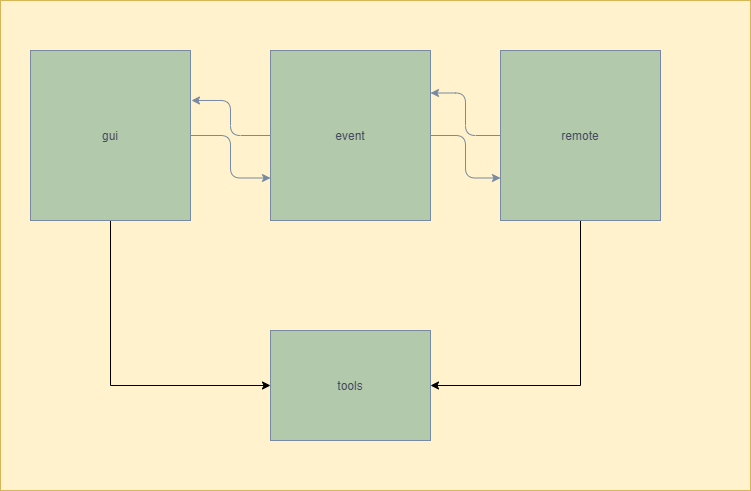

# 项目架构
> 
* 项目基于`pyqt5`开发
* 核心模块为`GUI`,`Signals & Slots`,`Client`,`Tools`四大模块
以及一个胶水模块,将核心模块进行有机结合
* `GUI`是项目的界面
* `Signals & Slots`是连接`GUI`和`Client`的通道
* `Client`是`IM通讯`的客户端
    * 提供`IM通讯`的能力,如`登录`,`接收和发送消息等`
    * 是抽象类,需要外部实现抽象方法,从而适配不同的`IM通讯协议`
* `Tools`工具模块
    * 提供关系型存储(sqlite3等)
    * 提供键值对存储
    * 提供键值对缓存(?)
* `胶水`模块
    * 胶水模块,或者说逻辑模块,是项目的载体
    * 会将核心模块根据`IM通讯`的一般业务场景,完成核心模块的组装

    